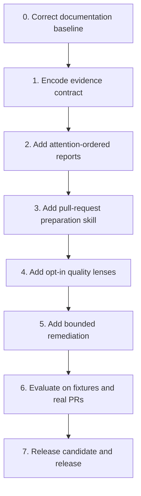

# Review evidence and comprehension implementation plan

## Outcome

Implement the proposed review-quality increment as small, independently reviewable checkpoints. No phase starts until the four proposed architecture decisions are accepted or amended.

Estimated effort: **5 to 7 engineering days**, excluding real pull-request evaluation wait time and release approval.

## Delivery sequence

Each phase ends with a clean checkpoint: changed paths listed, focused verification recorded, open decisions named, and no unrelated files staged.

## Phase 0 — Correct the baseline

Estimate: 0.5 day.

Changes:

- Align README archive examples with the current version or replace fixed versions with a documented placeholder.
- Update the product-requirements status/version history without rewriting accepted 0.1.0 scope as if it were new.
- Correct the claim that generated payloads are committed.
- Reconcile any remaining architecture, quality-gate, changelog, and marketplace wording.

Exit evidence:

- Documentation references agree that `payloads/` is generated and ignored.
- Current install examples resolve to the current release convention.
- `git diff --check` passes.

## Phase 1 — Encode the evidence contract

Estimate: 1 day.

Changes:

- Update `review-task`, `review-story-preflight`, `review-story-postflight`, `review-feature`, and `triage-pr-comments` with the shared three-state verdict.
- Preserve existing category, severity, and Found → Consequence → Suggested contracts.
- Define deterministic disposition: verified claims may report; disproved claims drop; inconclusive claims remain local.
- Add manual evaluation cases for supported, disproved, and inaccessible-evidence claims.

Exit evidence:

- Every changed skill uses the same verdict meanings.
- No example posts an inconclusive claim as a confirmed pull-request finding.
- Toolkit validation and inspection discover all existing skills with zero diagnostics.

## Phase 2 — Add attention-ordered reports

Estimate: 0.75 day.

Changes:

- Add a conditional change map to story pre-flight, story post-flight, and feature review.
- Define core, wiring, and mechanical groups.
- Define narrow triggers for pseudocode, concrete traces, and risk callouts.
- Preserve severity order for the actual finding list.

Exit evidence:

- A multi-layer fixture produces a useful map.
- A trivial fixture omits unnecessary pseudocode and diagrams.
- Generated or mechanical changes are summarized without being assumed safe.

## Phase 3 — Add `prepare-pr-for-review`

Estimate: 0.75 day.

Changes:

- Add one portable, self-contained skill.
- Inventory change groups, reviewer entry points, generated files, test evidence, description drift, unrelated changes, and commit legibility.
- Keep the default path read-only.
- Gate history rewriting behind an approved plan and verify tree identity before any proposed push.

Exit evidence:

- The repository validator accepts the new skill and rejects any bundled helper/reference file.
- A no-mutation scenario changes no Git object or working-tree file.
- A simulated cleanup scenario records equal before/after tree identifiers.

## Phase 4 — Add opt-in quality lenses

Estimate: 1 to 1.5 days.

Changes:

- Add `review-maintainability` with structural simplification, boundary ownership, atomicity, orchestration, and abstraction checks.
- Add `review-typescript` with discriminated states, external-data parsing, honest narrowing, schema derivation, exhaustiveness, total signatures, and structured telemetry checks.
- State explicit anti-rules: no automatic line-count blocker, no generic polish in lifecycle reviews, and no assertion that a representation enforces an invariant unless the type or constructor proves it.

Exit evidence:

- Each lens triggers only on explicit intent.
- Findings name a concrete consequence in changed scope.
- TypeScript evaluation includes a negative-duration counterexample and rejects the unsound claim.

## Phase 5 — Add bounded remediation

Estimate: 0.5 day.

Changes:

- Extend `respond-pr-comments` with an explicitly requested iterative mode.
- Require named targets, a positive maximum, per-iteration checkpoints, focused verification, and a stop report.
- Default to three iterations; prohibit unlimited mode and autonomous hooks.
- Keep persistence optional and separately gated.

Exit evidence:

- The procedure cannot start without target identifiers and explicit instruction.
- Maximum exhaustion reports remaining targets without claiming success.
- Completion requires verified closure evidence for all targets.

## Phase 6 — Evaluate behavior and portability

Estimate: 1 to 1.5 days plus external review time.

Run the repository gates:

1. `pnpm validate`
2. `pnpm inspect`
3. `pnpm payloads:build`
4. `pnpm payloads:verify`
5. `pnpm lint:plugin`
6. `pnpm test`
7. `git diff --check`

Then run scenario evaluations:

- A requirements violation with a verified finding.
- A plausible but disproved finding.
- An inaccessible dependency that forces `INCONCLUSIVE`.
- A mixed core/wiring/generated diff.
- A maintainability review with a large but justified file and a smaller but tangled change.
- A TypeScript boundary bug and an intentionally valid cast after full validation.
- A bounded remediation that succeeds and one that reaches its limit.
- A real remote pull request to verify line anchors and provider-capability behavior.

Do not report the real-provider evaluation as executed if authentication or access blocks it.

## Phase 7 — Release decision

Estimate: 0.5 day, after approval.

Before release:

- Run an adversarial feature review against the accepted specification and ADRs.
- Update README, architecture, quality gates, product requirements, changelog, version files, and skill count together.
- Confirm GitHub and Azure DevOps remain examples behind repository-local mappings.
- Build and verify all three host payloads.
- Present the release diff, version recommendation, and gate evidence for approval before commit, tag, push, or release creation.

## Review slices

| Slice | Files in scope | Review focus |
| --- | --- | --- |
| A | Documentation baseline | Contradictions and current-version accuracy |
| B | Existing review skills | Evidence semantics and no regression to write gates |
| C | Existing report skills | Change-map clarity and output compatibility |
| D | `prepare-pr-for-review` | Read-only default and tree-identity safety |
| E | Two quality-lens skills | Explicit triggering, factual rubric, low noise |
| F | `respond-pr-comments` | Bounded iteration and truthful completion |
| G | Packaging and release docs | Portability, deterministic payloads, version lockstep |

## Risks and mitigations

| Risk | Mitigation |
| --- | --- |
| Repeated evidence text drifts across self-contained skills. | Use one canonical protocol during authoring, compare every embedded copy during review, and add targeted scenario checks. |
| New lenses overwhelm users with general advice. | Require explicit invocation and changed-scope consequences. |
| Change maps duplicate the diff. | Make them conditional and cap commentary to reviewer entry information. |
| Inconclusive claims are treated as warnings. | Define a strict local-only disposition and test it. |
| Iterative remediation becomes autonomous. | Require explicit targets, a positive maximum, and user-gated persistence. |
| Line anchors remain agent-dependent. | Retain summary fallback and run a real pull-request evaluation before release. |

## Resume checklist

At any stop point, record:

- Last completed phase and slice.
- Changed paths and whether they are staged.
- Commands run with their outcomes.
- Manual scenarios completed.
- Open decisions or blocked external checks.
- Exact next safe action.

## References

- `AI_Codex/Architecture/Agent-Governance/review-evidence-autonomous-execution.md`
- `AI_Codex/Knowledge/References.md`
- `AI_Codex/Features/review-evidence-and-comprehension.md`
- `AI_Codex/Architecture/Protocols/review-evidence-and-presentation.md`
- `AI_Codex/Architecture/ADR/ADR-0002-intent-first-core-and-opt-in-quality-lenses.md`
- `AI_Codex/Architecture/ADR/ADR-0003-three-state-evidence-verdicts.md`
- `AI_Codex/Architecture/ADR/ADR-0004-attention-ordered-change-maps.md`
- `AI_Codex/Architecture/ADR/ADR-0005-bounded-remediation-without-autonomous-hooks.md`
- `docs/quality-gates.md`
