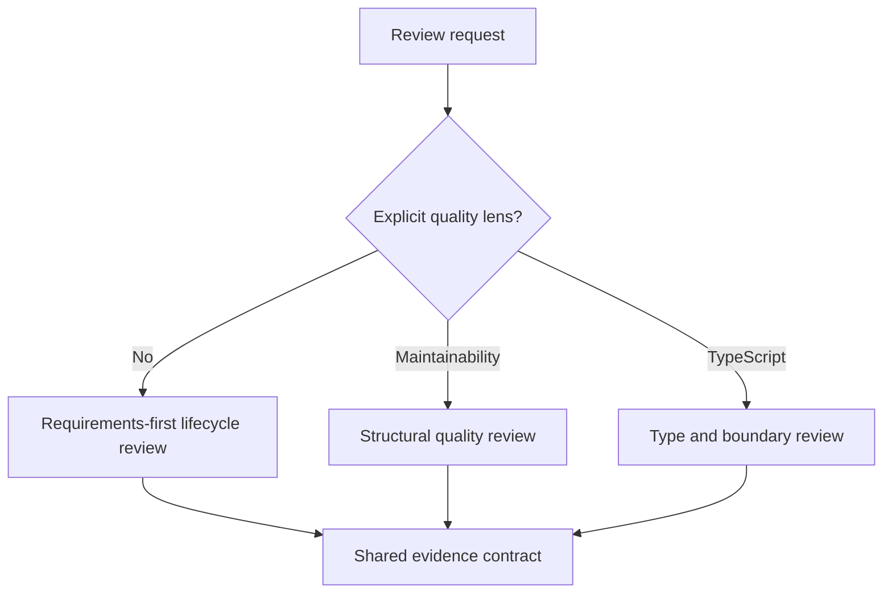

# ADR-0002 — Intent-first core and opt-in quality lenses

## Status

**Proposed.**

## Context

The current product judges work against its documented goal, requirements, completion criteria, and explicit exclusions. It permits improvement findings only when they are pertinent to that intent. The mined maintainability and TypeScript rubrics can expose real defects, but applying them by default would silently broaden scope and produce general code-polish findings.

## Decision

Keep all lifecycle skills requirements-first. Add broad structural and TypeScript review as separately invoked, read-only skills:

- `review-maintainability`
- `review-typescript`

The lifecycle skills may still report a structural or type problem when it has a direct consequence for a requirement, correctness, security, performance, or the approved design. The optional skills may inspect maintainability as their explicit subject, but every finding must still be changed-scope, evidence-backed, and actionable.

File-size thresholds are investigation triggers, not automatic findings. Type advice must be validated against runtime behavior and actual invariants rather than copied from a rubric.

## Options considered

| Option | Effect | Verdict |
| --- | --- | --- |
| Apply every rubric to every review | Maximum breadth, but violates the no-invented-requirements rule and increases noise. | Rejected |
| Add opt-in quality skills | Preserves the core contract and makes broader judgment explicit. | Chosen |
| Ignore the mined quality rubrics | Avoids scope risk but loses useful structural and language-specific analysis. | Rejected |

## Consequences

- Existing review behavior remains predictable.
- Users can request a deliberately harsh maintainability review without redefining lifecycle review.
- Two new skills repeat some evidence and reporting guidance because shared payload references cannot ship.
- The first language-specific skill is an experiment, not yet a general extension framework.

## References

- `AI_Codex/Knowledge/References.md`
- `docs/specs/product-requirements.md`
- `plugins/monolithic-code-review-toolkit/skills/review-task/SKILL.md`
- `plugins/monolithic-code-review-toolkit/skills/review-feature/SKILL.md`
