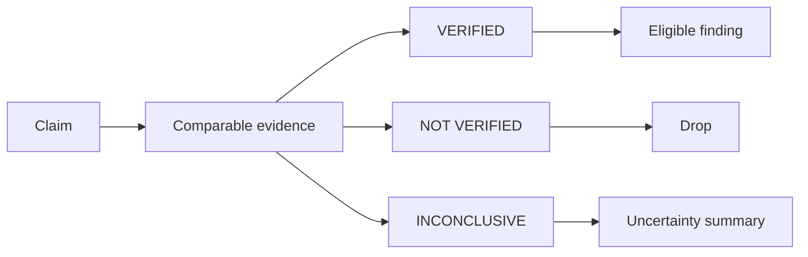

# ADR-0003 — Three-state evidence verdicts

## Status

**Proposed.**

## Context

Post-flight review drops unverified findings, while comment triage labels claims `true` or `false`. A binary result cannot distinguish a disproved claim from one that cannot be tested because evidence or a valid baseline is unavailable.

## Decision

Use `VERIFIED`, `NOT VERIFIED`, and `INCONCLUSIVE` for every material claim. Keep category, severity, and the comment-triage action recommendation as independent fields.

Only a verified claim may become a confirmed inline pull-request finding. An inconclusive claim is visible locally where uncertainty matters, but it is never presented as a softened finding.

## Options considered

| Option | Effect | Verdict |
| --- | --- | --- |
| Keep skill-specific verdicts | Minimal change, inconsistent uncertainty semantics. | Rejected |
| Use a binary true/false verdict | Simple, but conflates lack of evidence with disproof. | Rejected |
| Use a three-state verdict | Honest uncertainty with deterministic disposition. | Chosen |

## Consequences

- Review claims gain a consistent evidence threshold.
- Human comments can be assessed without forcing a false binary judgment.
- Existing post-flight behavior remains strict: claims that do not verify are not posted inline.
- Skill output examples and manual evaluation cases must be updated together.

## References

- `AI_Codex/Architecture/Protocols/review-evidence-and-presentation.md`
- `plugins/monolithic-code-review-toolkit/skills/review-story-postflight/SKILL.md`
- `plugins/monolithic-code-review-toolkit/skills/triage-pr-comments/SKILL.md`
