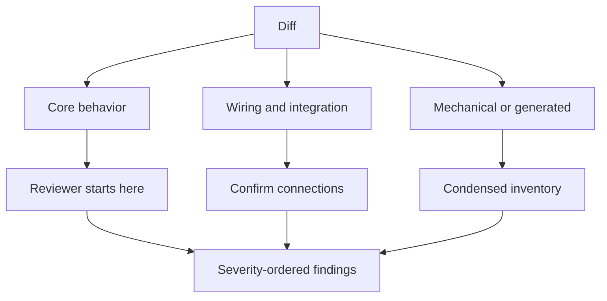

# ADR-0004 — Attention-ordered change maps

## Status

**Proposed.**

## Context

Severity-ordered findings support decisions but do not explain the topology of a change. File-tree order also does not reflect reviewer value. Reviewers benefit from seeing core behavior before wiring and mechanical changes, with extra representations only for genuinely difficult logic.

## Decision

Add an optional change-map section before findings. It groups the diff into core behavior, wiring and integration, and mechanical or generated work. The existing finding list remains severity ordered.

Pseudocode, a concrete before/after trace, or a labeled risk callout is added only when it materially reduces reasoning effort.

## Options considered

| Option | Effect | Verdict |
| --- | --- | --- |
| Preserve file-tree order | Easy to generate, costly for reviewers. | Rejected |
| Replace finding reports with a visual map | Loses the existing decision contract. | Rejected |
| Add a change map before findings | Improves orientation while preserving decisions. | Chosen |

## Consequences

- Review artifacts gain a predictable entry point without requiring a host-specific Canvas application programming interface.
- Simple diffs can omit the map and avoid ceremony.
- Skills must clearly separate neutral change description from verified findings.
- `prepare-pr-for-review` becomes the dedicated surface for reviewability cleanup proposals.

## References

- `AI_Codex/Knowledge/References.md`
- `AI_Codex/Architecture/Protocols/review-evidence-and-presentation.md`
- `plugins/monolithic-code-review-toolkit/skills/review-story-preflight/SKILL.md`
- `plugins/monolithic-code-review-toolkit/skills/review-story-postflight/SKILL.md`
