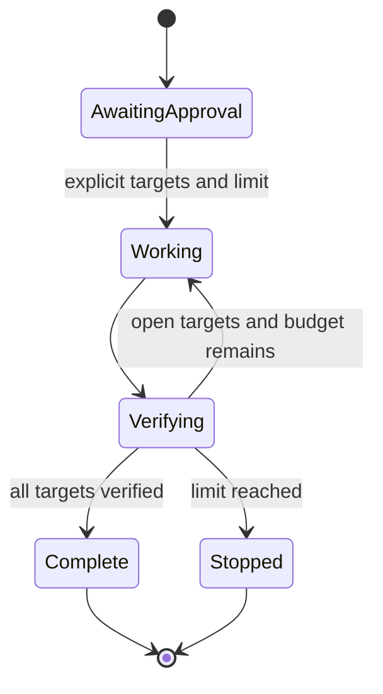

# ADR-0005 — Bounded remediation without autonomous hooks

## Status

**Proposed.**

## Context

Repeated fix-and-verify cycles can resolve a set of review findings efficiently. A Ralph-style hook loop provides persistence by resubmitting an unchanged prompt, but the toolkit currently gates actions through explicit user decisions and ships no root hooks under its enforced payload contract.

## Decision

Add an optional bounded remediation procedure to `respond-pr-comments`. It runs only after the user names approved targets and requests iterative remediation. It defaults to three iterations, requires a positive maximum, and completes only with objective closure evidence for every target.

Do not add autonomous continuation hooks. Do not support an unlimited mode. Do not persist cycle state unless the user separately approves the write.

## Options considered

| Option | Effect | Verdict |
| --- | --- | --- |
| Ship a stop-hook loop | Automatic continuation, but conflicts with portability and approval boundaries. | Rejected |
| Allow unlimited iterative remediation | Maximum autonomy, unacceptable runaway risk. | Rejected |
| Use a bounded, explicit procedure | Gains iterative correction while preserving user control. | Chosen |
| Do not support iteration | Safest, but forces repetitive manual restarts for clear, approved targets. | Rejected |

## Consequences

- Iteration is resumable through explicit checkpoints rather than hidden hook state.
- Reaching the maximum produces an incomplete report, never a false completion.
- The procedure remains host-neutral and self-contained.
- Persisted state is optional and user-gated, so read-only reviews remain read-only.

## References

- `AI_Codex/Knowledge/References.md`
- `AI_Codex/Architecture/Protocols/review-evidence-and-presentation.md`
- `AI_Codex/Architecture/ADR/ADR-0001-skill-runtime-under-payload-allowlist.md`
- `plugins/monolithic-code-review-toolkit/skills/respond-pr-comments/SKILL.md`
