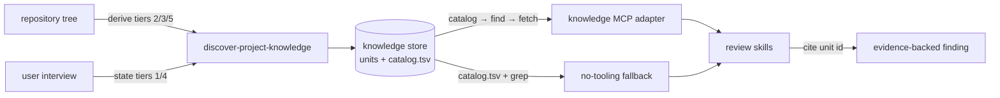

# ADR-0006 — Project knowledge store and lookup contract

## Status

**Proposed.**

## Context

Reviews measure a diff against its work item. They have never had a source for what the *project*
requires of any change. No skill read `CLAUDE.md`, `CONTRIBUTING`, an ADR index, or an architecture
document; the only project fingerprint recorded was `quality_lenses.typescript`, effectively a
boolean.

The cost of that gap is visible in the skills themselves. `review-feature` asks whether a feature
matches "the design it was approved against" and can answer only from tracker artifacts.
`triage-pr-comments` instructs the agent to find a project convention in the repository and cite it,
with no index to find it in. `prepare-pr-for-review` re-infers which paths are generated on every
run. And `review-task` drops any improvement that "would apply equally to code this task never
touched" — correct as a filter on generic polish, but it also makes divergence from the codebase's
own patterns unreportable.

Writing this down raises two risks that shape the decision. Retrieval must be cheap and verifiable,
or a review pays a large context cost for facts it did not need. And the tiers most worth recording
— purpose, ownership, and the rationale behind rules — are exactly the ones a machine cannot derive,
so a store that infers them produces fabricated rules that read like real ones.

## Decision

**Record project knowledge as a deterministic tree of Markdown units with YAML frontmatter, plus
TSV for uniform record sets, addressed lexically before semantically.**

Retrieval is a three-rung cost ladder — routing table, then search, then one unit — and the layout
is deterministic so `catalog.tsv` plus `grep` satisfies the same ladder with no tooling at all. A
vector-only path is rejected outright: it has no verifiable failure mode.

**Every unit carries a `provenance` of `derived`, `stated`, or `assumed`,** and only the first two
may be cited as a project rule. `assumed` is `INCONCLUSIVE` by construction, reusing the evidence
vocabulary the review skills already enforce. `discover-project-knowledge` therefore derives Tiers
2, 3 and 5 mechanically and **interviews** the user for Tier 1 identity and Tier 4 rationale.

**Refresh is incremental.** Units name their `sources`; a refresh re-derives only units whose source
paths changed since `derived_from_commit`, and never rewrites a `stated` unit without asking.

**The tool surface ships as `adapters/knowledge/`, not inside the plugin.** ADR-0001 restricts a
skill directory to `SKILL.md`, so the contract lives as prose in the skill and as an executable MCP
server in an optional adapter — the same split the review-orchestrator adapters already use.

**That adapter carries this repository's first third-party Python dependency** (`mcp`, `pydantic`),
pinned to `mcp>=2.0,<3` because `FastMCP` was renamed `MCPServer` in 2.0 and the v1 import path no
longer exists. The dependency is confined to the adapter: the portable plugin and both orchestrator
adapters still run from a checkout with nothing installed.

## Options considered

| Option | Effect | Verdict |
| --- | --- | --- |
| One monolithic `CONTEXT.md` | Trivial to write; forces a full read for one fact and has no routing layer. | Rejected |
| Deeply nested JSON knowledge base | Machine-friendly, but expensive to read and hostile to human editing of the tiers that most need it. | Rejected |
| Embeddings with no keyword path | Handles paraphrase; has no verifiable failure mode and cannot explain a miss. | Rejected |
| SQLite + FTS5 now | Real `WHERE` queries; premature at this corpus size and breaks grep-ability. | Deferred until a relational query exists |
| Markdown units + TSV records, lexically addressed | Progressive disclosure, one fact one home, greppable, human-editable. | **Chosen** |
| Ship the tool surface inside the plugin | One artifact; forbidden by ADR-0001 and unshippable to any host. | Rejected |
| Prose contract only, no server | Fully portable; loses ranking, backlinks, bounded output and safe concurrent writes. | Rejected as the only option; retained as the fallback |
| Infer every tier automatically | Fast and unattended; fabricates rules that a review would post to a pull request. | Rejected |

## Consequences

- A review can cite a documented rule by unit id, so divergence from the project's own architecture
  becomes a finding with evidence rather than an opinion.
- `provenance` bounds that power. An inferred convention can never be reported as a project rule,
  which preserves the no-invented-requirements guarantee that the toolkit already makes.
- First-run setup costs an interview. That is the point: the tiers worth the most are the ones only
  a human can supply.
- The store can go stale. Incremental refresh and `derived_from_commit` make staleness detectable,
  and store drift is reported under local uncertainty rather than held against a diff.
- CI gains a dependency-install step. The knowledge adapter's MCP contract tests skip without the
  SDK, so that step is what keeps them from silently degrading to store-only coverage.
- Adding a dependency at all is a deviation from a repository that had none. Confining it to one
  optional adapter keeps the portable plugin's install story unchanged.

## References

- `AI_Codex/Architecture/ADR/ADR-0001-skill-runtime-under-payload-allowlist.md`
- `AI_Codex/Architecture/ADR/ADR-0003-three-state-evidence-verdicts.md`
- `AI_Codex/Architecture/Protocols/review-evidence-and-presentation.md`
- `plugins/monolithic-code-review-toolkit/skills/discover-project-knowledge/SKILL.md`
- `plugins/monolithic-code-review-toolkit/skills/review-setup/SKILL.md`
- `adapters/knowledge/README.md`
