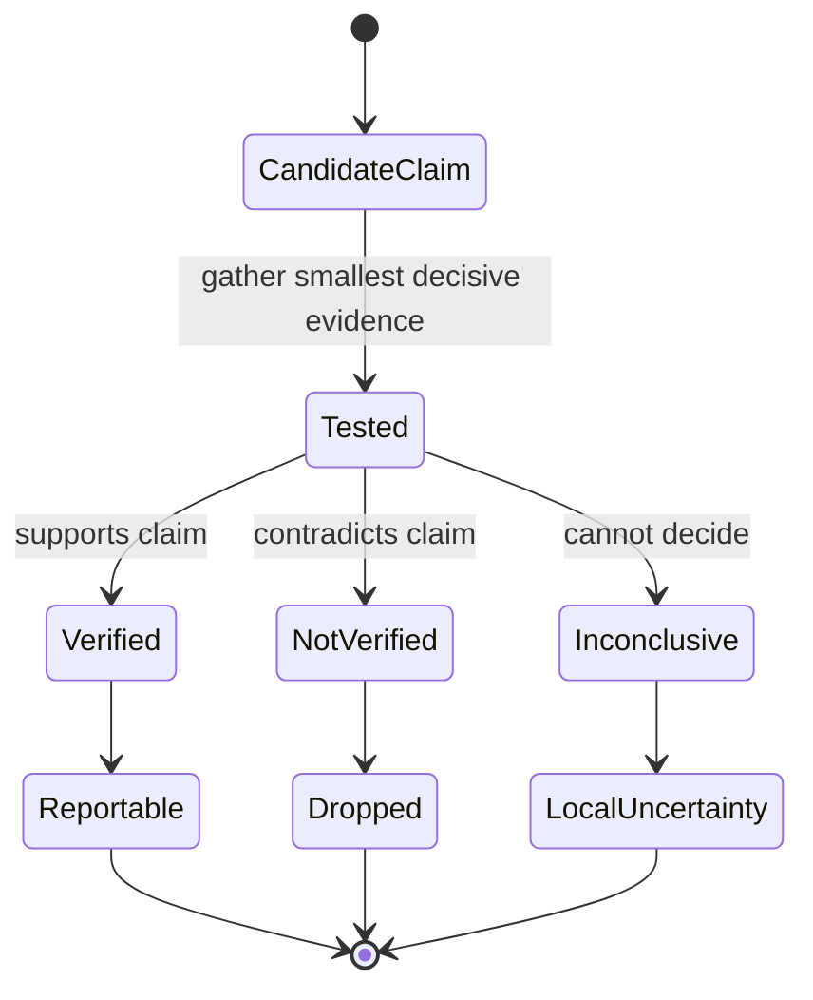
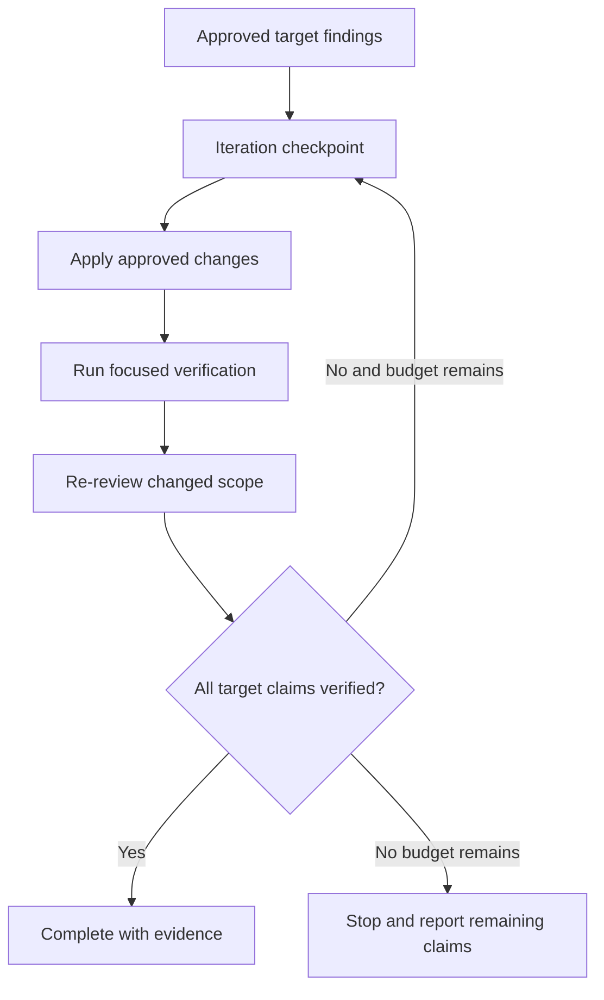

# Review evidence and presentation protocol

## Purpose

This protocol defines how a review claim becomes a reportable finding and how a change set is presented for fast human comprehension. It is host-neutral and can be embedded in self-contained skills.

## Evidence record

Every material claim uses this logical record. It is an output contract, not a required structured-data file.

| Field | Meaning | Required |
| --- | --- | --- |
| `id` | Stable identifier within the review run. | Yes |
| `claim` | A falsifiable statement about behavior, scope, risk, or a reviewer comment. | Yes |
| `expected` | Requirement, invariant, threshold, or predicted direction. | Yes |
| `evidence` | Source lines, command result, artifact, or official documentation used to test the claim. | Yes |
| `baseline` | Comparable earlier behavior or state. | Only for before/after claims |
| `treatment` | Changed behavior or state measured the same way. | Only for before/after claims |
| `confounds` | Missing access, environment mismatch, noise, or another reason the comparison may be invalid. | When present |
| `verdict` | `VERIFIED`, `NOT VERIFIED`, or `INCONCLUSIVE`. | Yes |
| `disposition` | `report`, `drop`, or `local-uncertainty`. | Yes |

### Verdict rules

- `VERIFIED`: the evidence supports the claim and meets the stated invariant or threshold.
- `NOT VERIFIED`: the evidence contradicts the claim or misses the stated threshold.
- `INCONCLUSIVE`: the evidence cannot decide because the baseline, access, measurement, or environment is invalid or incomplete.

An inline pull-request comment may be created only from `VERIFIED`. `INCONCLUSIVE` is not softened into a warning. In post-flight review it is counted in the local summary; in comment triage it remains visible so the user knows the reviewer claim could not be decided.

## Finding contract

A reportable finding retains the existing contract:

1. **Found:** the verified problem and its exact location.
2. **Consequence:** the concrete behavior, requirement, or operational risk.
3. **Suggested:** the smallest credible remedy or decision.

Category and severity remain separate from evidence verdict. `VERIFIED` does not imply high severity; it only means the claim survived testing.

## Change-map contract

The change map precedes findings when a diff has multiple responsibilities or significant review noise.

| Group | Content | Presentation |
| --- | --- | --- |
| Core behavior | Algorithms, state transitions, domain rules, public contracts. | First; full context for important hunks. |
| Wiring and integration | Routes, dependency wiring, configuration, adapters. | Second; condensed to the context needed for correctness. |
| Mechanical or generated | Formatting, renames, imports, generated files, re-exports. | Last; paths and statistics unless risk is present. |

For each group, identify reviewer entry points and cross-file relationships. Do not reorder the underlying diff or imply that mechanical changes are risk-free.

### Conditional aids

Add pseudocode only when syntax or nesting hides the essential algorithm. Add a concrete before/after trace only when the observable outcome is hard to predict. Add a labeled callout only for a genuinely subtle, breaking, concurrent, security, or performance-sensitive point.

## Bounded remediation cycle

A remediation cycle runs only after explicit user instruction and targets named findings or review comments.

The checkpoint records the iteration number, maximum, target finding identifiers, changed paths, verification evidence, and remaining claims. Default maximum: three. A completion statement is valid only when every target finding has `VERIFIED` closure evidence. Reaching the maximum is a stop condition, not success.

Persisting checkpoint state requires separate user approval. Without it, the state remains in the active conversation.

## Quality lens integration

Lifecycle reviews (`review-task`, story pre/post-flight, `review-feature`) remain requirements-first.
Quality lenses extend them without replacing intent checks.

| Lens | Trigger |
| --- | --- |
| TypeScript | `quality_lenses.typescript: mandatory` in `sources.json`, changed `.ts`/`.tsx` in scope, `--lenses typescript`, or `--lenses all`. |
| Maintainability | `--lenses maintainability` or `--lenses all` only; never silent. |

When triggered, the agent executes the matching lens skill procedure on the same changed scope and
merges only `VERIFIED` findings into a labeled subsection of the lifecycle report. User-invoked
lifecycle skills advertise supported flags in their skill descriptions.

## Skill mapping

| Skill | Evidence protocol | Change map | Bounded cycle |
| --- | --- | --- | --- |
| `review-task` | Yes | Only for multi-responsibility diffs | No |
| `review-story-preflight` | Yes | Yes when it improves reviewer entry | No |
| `review-story-postflight` | Yes | Yes in local preview and summary | No |
| `review-feature` | Yes | Yes, grouped by behavior and story seams | No |
| `triage-pr-comments` | Yes; replaces binary fact-check | Organize comments by risk and code area | No |
| `respond-pr-comments` | Closure evidence | No | Optional, explicit only |
| `prepare-pr-for-review` | Tree identity and description claims | Always | No |
| `review-maintainability` | Yes | Group by structural concern | No |
| `review-typescript` | Yes | Group by type/boundary concern | No |

## References

- `AI_Codex/Knowledge/References.md`
- `AI_Codex/Features/review-evidence-and-comprehension.md`
- `plugins/monolithic-code-review-toolkit/skills/review-story-postflight/SKILL.md`
- `plugins/monolithic-code-review-toolkit/skills/triage-pr-comments/SKILL.md`
- `plugins/monolithic-code-review-toolkit/skills/respond-pr-comments/SKILL.md`
