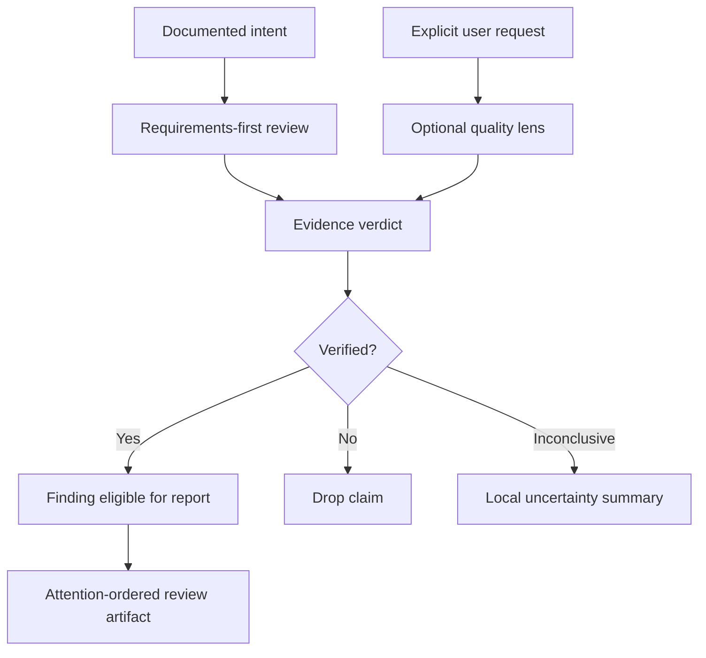
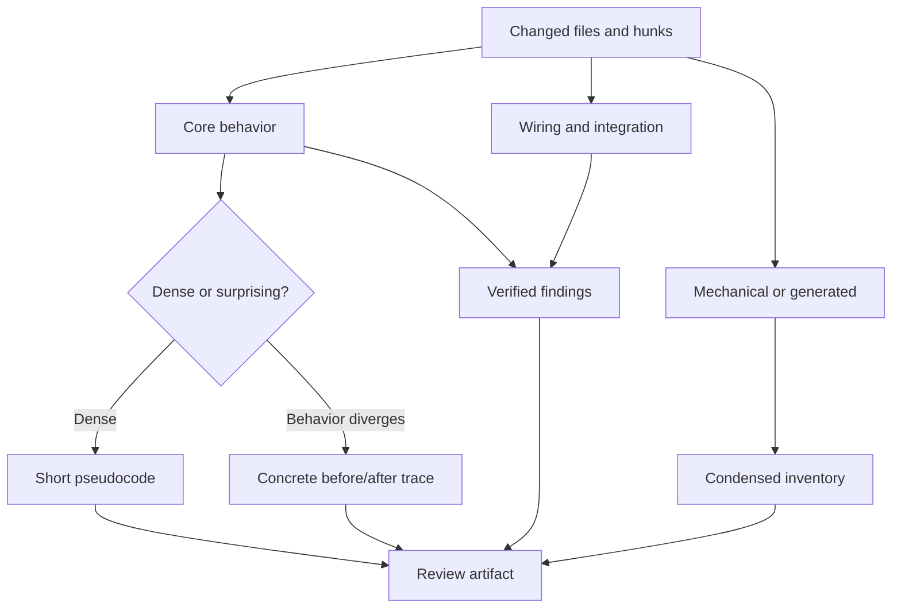

# Review evidence and comprehension

## What this specification is

This specification proposes the next review-quality increment for the Monolithic Code Review Toolkit. It preserves the existing requirements-first product and adds stronger evidence handling, faster reviewer orientation, and explicitly requested quality lenses.

The proposal is planning only. It does not authorize source-skill changes, history rewriting, pull-request comments, or a release.

## Recommendation

Adopt four compatible improvements and reject one implementation mechanism:

1. Add a three-state evidence verdict to every material review claim.
2. Add an attention-ordered change map before detailed findings when it reduces reviewer effort.
3. Add three opt-in skills: `prepare-pr-for-review`, `review-maintainability`, and `review-typescript`.
4. Add a bounded remediation protocol to `respond-pr-comments`, activated only by explicit instruction.
5. Do not ship a Ralph-style autonomous hook loop. The portable payload and user-approval model make an agent-controlled continuation mechanism the wrong default.

## Background

The toolkit currently ships seven self-contained skills. They obtain work-item and pull-request data through repository-local capability mappings, compare a diff against documented intent, and gate every external write. This protects the product from becoming a generic linting assistant.

The mined sources contribute useful ideas, but some conflict with that foundation. A strict maintainability audit can generate valuable structural findings, yet it becomes scope drift when silently inserted into every requirements review. A self-repeating hook can make progress persistent, yet it can also bypass the user's decision points. The design therefore separates the stable review core from explicit lenses and bounded actions.

## Problems and evidence

### Verification is procedural but not normalized

Post-flight review already fact-checks findings, and comment triage already assesses factual accuracy. However, the skills use different verdict vocabularies and do not share a minimum evidence record. This makes uncertainty handling inconsistent.

Evidence: `plugins/monolithic-code-review-toolkit/skills/review-story-postflight/SKILL.md` and `plugins/monolithic-code-review-toolkit/skills/triage-pr-comments/SKILL.md`.

### Reports optimize findings, not reviewer orientation

The existing reports prioritize severity, which is correct for decisions, but they do not first explain the shape of the change. A reviewer may still spend attention reconstructing which files contain core behavior, which only connect it, and which are mechanical.

Evidence: `plugins/monolithic-code-review-toolkit/skills/review-story-preflight/SKILL.md`, `plugins/monolithic-code-review-toolkit/skills/review-story-postflight/SKILL.md`, and `plugins/monolithic-code-review-toolkit/skills/review-feature/SKILL.md`.

### Broad quality advice conflicts with the product contract

The accepted requirements admit an `improvement` only when it is pertinent to the work item's goal. Automatically applying a severe structural or TypeScript rubric would invent review scope.

Evidence: `docs/specs/product-requirements.md` and `plugins/monolithic-code-review-toolkit/skills/review-task/SKILL.md`.

### Autonomous continuation does not fit existing write gates

The toolkit intentionally places a user decision between analysis and action. A stop-hook loop that resubmits work until the agent declares completion would create a second orchestration model and could continue after a decision should return to the user.

Evidence: `plugins/monolithic-code-review-toolkit/skills/respond-pr-comments/SKILL.md`, `docs/specs/product-requirements.md`, and `AI_Codex/Architecture/ADR/ADR-0001-skill-runtime-under-payload-allowlist.md`.

### Documentation has release drift

The current checkout is version 0.1.1, while the product requirements and some README examples still describe 0.1.0. The acceptance text also says generated payloads are committed, contradicting the architecture and quality-gate documents.

Evidence: `VERSION`, `README.md`, `docs/specs/product-requirements.md`, `docs/architecture.md`, and `docs/quality-gates.md`.

## Proposed capability model

### Core capabilities

The seven existing skills remain requirements-first. Their finding categories, severities, provider independence, and write gates remain unchanged. They adopt the shared evidence verdict and may add a change map when it is useful.

### Opt-in capabilities

| Skill | Purpose | Default mutation |
| --- | --- | --- |
| `prepare-pr-for-review` | Explain reviewer entry points, separate core/wiring/mechanical changes, identify history or description noise, and propose safe cleanup. | None |
| `review-maintainability` | Perform an explicitly requested structural review for complexity deletion, boundary ownership, atomicity, and abstraction quality. | None |
| `review-typescript` | Apply evidence-backed TypeScript type and boundary checks to changed `.ts` and `.tsx` code. | None |

`prepare-pr-for-review` may propose history rewriting but must obtain approval before mutation and must prove Git tree identity afterward. If the tree changes unexpectedly, it stops without pushing.

`review-maintainability` treats file size as a prompt for investigation, not a blocker by number alone. It reports only changed-scope findings with a concrete consequence and a credible remedy.

`review-typescript` must not repeat a rule merely because the source rubric states it. It checks the actual type and runtime invariant. In particular, a plain numeric duration does not prevent negative values.

## Review artifact

The report gains two layers with different jobs:

1. The **change map** tells the reviewer where to spend attention.
2. The **finding list** tells the decision-maker what must change and why.

Pseudocode and example traces are conditional. Straightforward changes do not gain a second representation. Risk callouts are sparse so they retain signal.

## Acceptance criteria

- [ ] Preserve the current requirements-first ordering in every existing lifecycle review.
- [ ] Define one evidence record and the verdicts `VERIFIED`, `NOT VERIFIED`, and `INCONCLUSIVE`.
- [ ] Prevent `NOT VERIFIED` and `INCONCLUSIVE` claims from becoming confirmed inline pull-request findings.
- [ ] Add an attention-ordered change map without replacing severity-ordered findings.
- [ ] Add the three opt-in skills as self-contained `SKILL.md` files with portable frontmatter only.
- [ ] Require explicit approval before history rewriting, code changes, pull-request posts, or persisted cycle state.
- [ ] Require tree-identity verification after reviewability-only history cleanup.
- [ ] Limit remediation cycles by a declared maximum and objective exit evidence.
- [ ] Preserve repository-local tracker and source-control provider mappings.
- [ ] Pass repository validation, unit tests, toolkit validation and inspection, and deterministic payload verification for all three hosts.
- [ ] Correct version and payload-commit contradictions in current documentation.

## Out of scope

- An executable review engine or a new package/runtime.
- Product-specific Canvas components.
- Automatic pull-request approval, thread resolution, or comment posting.
- A background or unbounded agent loop.
- Generic cleanup findings inside requirements-first reviews.
- Rewriting history merely to make commit names prettier.

## Open questions and recommendations

### Should review state be written to the consuming repository?

Recommendation: default to chat-local state. Permit `.monolithic-code-review/reviews/<scope>.md` only when the user explicitly asks for a resumable artifact. This avoids adding files during a read-only review.

### Should the TypeScript lens become a general language-pack framework now?

Recommendation: no. Ship one opt-in TypeScript skill, observe its value, and only then extract a language-pack convention. The current payload model has no shared reference mechanism.

### What should the default remediation limit be?

Recommendation: three iterations. The user may choose another positive limit. Unlimited mode is not supported.

### Should architecture decision record ADR-0001's external runtime option be reopened?

Recommendation: not for this increment. First improve the procedural contract and run real-pull-request evaluations. Reopen the runtime decision only with evidence of wrong line anchors or unacceptably inconsistent agent behavior.

## References

- `AI_Codex/Knowledge/References.md`
- `docs/specs/product-requirements.md`
- `docs/architecture.md`
- `docs/quality-gates.md`
- `AI_Codex/Architecture/ADR/ADR-0001-skill-runtime-under-payload-allowlist.md`
- `plugins/monolithic-code-review-toolkit/skills/`
